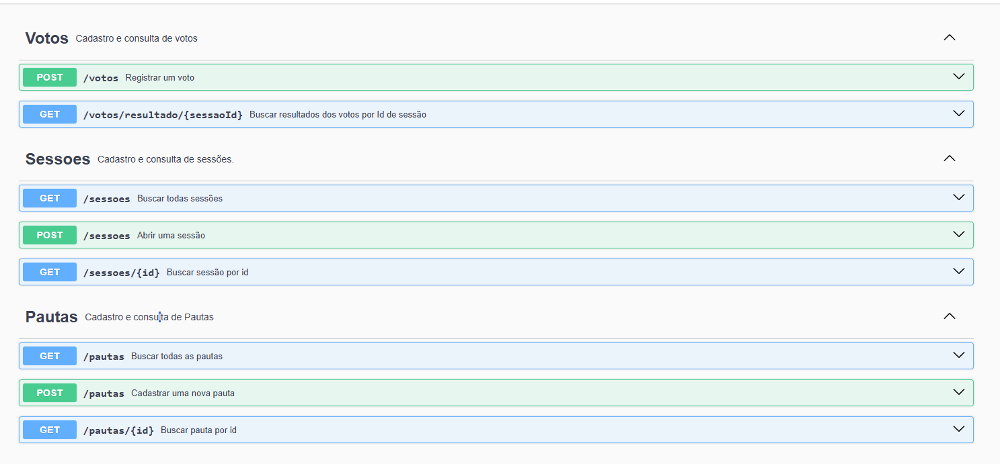
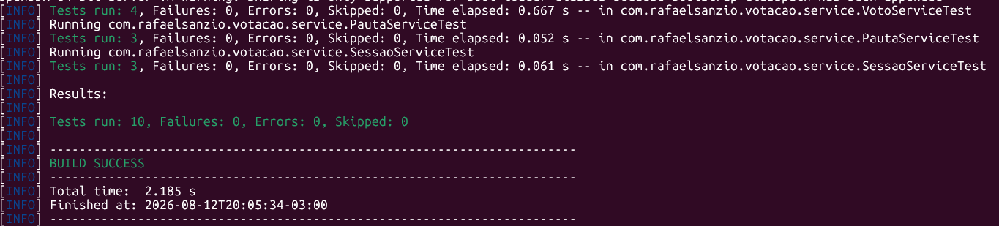
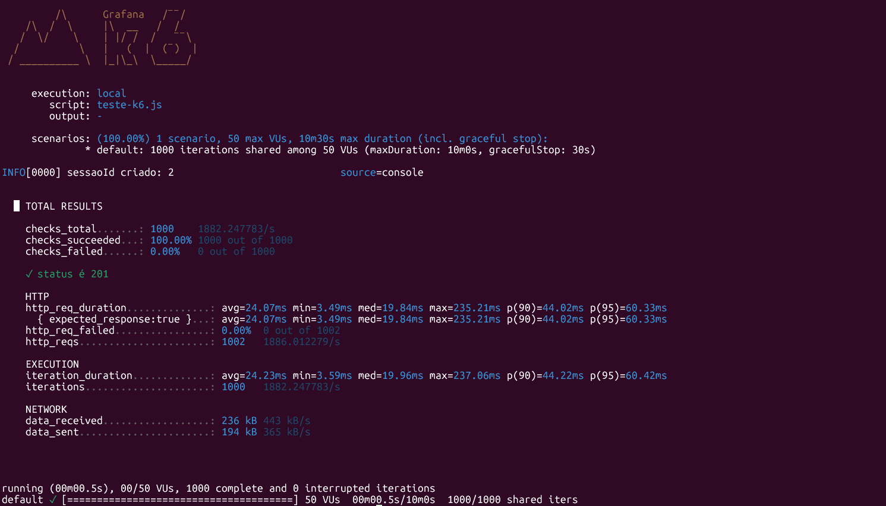

# Votação

## Sobre o projeto
Repositório criado para o Desafio de Votação por Rafael Sanzio.

## Tecnologias utilizadas
- Java 21
- Spring Boot
- Spring Web MVC
- Spring Data JPA
- Bean Validation
- PostgreSQL 17
- Lombok
- Springdoc OpenAPI/Swagger
- JUnit 5
- Mockito
- Docker
- k6

## Execução via Docker (recomendado)
### Pré-requisitos 
- Docker instalado (Docker Desktop / Docker Engine e Docker Compose)

### Subindo com Docker Compose
Na raiz do projeto /desafio-votacao rode `docker compose up`

O docker irá iniciar a API e o banco de dados.

## Execução local
### Pré-requisitos para rodar localmente
- Java 21
- Maven
- PostgreSQL 17, com um banco `votacao` criado

### Variáveis de ambiente
- `SPRING_DATASOURCE_URL` -> Padrão: `jdbc:postgresql://localhost:5432/votacao`
- `SPRING_DATASOURCE_USERNAME` -> Padrão: `postgres`
- `SPRING_DATASOURCE_PASSWORD` -> Padrão: `postgres`
- `CPF_VALIDACAO_DESATIVADA` -> Padrão: `false` (Desativa o sorteio aleatório de validez de CPF (associadoId). Por padrão está opção está DESLIGADA)

### Subindo localmente
Linux/WSL: `./mvnw spring-boot:run`

Windows: `.\mvnw.cmd spring-boot:run`


## Acessar
A aplicação estará na porta `http://localhost:8080/api/v1`
### Acessando a documentação Swagger
Com a aplicação em execução acesse: `http://localhost:8080/api/v1/swagger-ui/index.html`



## Endpoints

Pautas
- `POST /api/v1/pautas` -> `{ "titulo": "...", "descricao": "..." }`
- `GET /api/v1/pautas`
- `GET /api/v1/pautas/{id}`

Sessões
- `POST /api/v1/sessoes` -> `{ "pautaId": 1, "duracaoEmMinutos": 5 }` (duração opcional, padrão 1 minuto)
- `GET /api/v1/sessoes`
- `GET /api/v1/sessoes/{id}`

Votos
- `POST /api/v1/votos` -> `{ "sessaoId": 1, "associadoId": "12345678900", "voto": "SIM" }` (associadoId é validado pelo `CpfClientFake`)
- `GET /api/v1/votos/resultado/{sessaoId}`

Exemplos completos estão disponíveis no Swagger.


## Decisões tomadas
### Modelagem das entidades (Pauta, Sessão, Voto)
Três entidades: `Pauta` (o assunto votado), `Sessão` (o período de votação de
uma pauta) e `Voto` (o voto de um associado numa sessão).
### Separação entre DTO e Model
DTOs foram utilizados para definir os contratos de entrada e saída da API. Os DTOs de request recebem e validam os dados enviados pelo cliente, enquanto os DTOs de response retornam apenas as informações necessárias.
O Uso de DTOs relacionados a uma entidade de domínio fica restrito a camada de controllers, responsável pela comunicação HTTP. Apenas as camadas de service e repository trabalham diretamente com entidades de domínio.
### Ausência de Interfaces nos services
Os services possuem apenas uma implementação e representam regras de negócio da aplicação. Evitando abstrações desnecessárias. Dependências externas, como a `CpfClient`, foram abstraídas por interface.

## Tarefas bônus
### Integração com sistema externo (validação de CPF)
A validação foi feita em `CpfClient`. A implementação simula CPF inválido de forma aleatória, 10% de chance de Cpf inválido, 10% de chance de não poder votar e 80% de chance de ser um Cpf válido. A validação pode ser desativada pela variável `CPF_VALIDACAO_DESATIVADA`.
### Performance
Foram adotadas algumas decisões para favorecer as consultas e operações frequentes: índices nas chaves de relacionamento de sessões e dos votos e consultas apenas de existência para verificar voto duplicado e contagem de votos, evitando carregar dados em memória.

O fechamento da sessão não depende de nenhuma função rodando em segundo plano. A data e hora de fechamento são salvas assim que uma sessão é aberta, cada consulta apenas compara o horário atual com a data de fechamento, evitando jobs checando sessões periodicamente.

Testes de carga foram feitos usando k6: o script envia 50.000 votos e calcula o tempo de resposta da aplicação.

### Versionamento da API
A API utiliza versionamento por URL, com o prefixo `/api/v1`. Uma nova versão pode ser disponibilizada em `/api/v2`.
## Testes
### Testes unitários
Foram criados testes unitários para  as regras de negócio dos services e validar os fluxos do controller, utilizado JUnit 5 e Mockito.
Os testes cobrem:
- Criação e consulta de Pautas
- Busca de Pautas Inexistentes
- Abertura de sessão com duração informada e padrão
- Bloqueio de abertura de múltiplas sessões para pauta que já possui sessão aberta
- Registro de voto
- Bloqueio de voto em sessões encerradas
- Bloqueio de votos duplicados na mesma pauta
- Consulta de resultado após o encerramento de uma sessão
- Criação de pauta pelo endpoint;
- Abertura de sessão pelo endpoint;
- Registro de voto pelo endpoint.

Para a execução dos testes, rode:

Windows: `.\mvnw.cmd test`

Linux/WSL: `./mvnw test`

### Testes de performance (k6)
#### Pré-requisitos:
- K6 ->
[Guia de instalação do k6](https://grafana.com/docs/k6/latest/set-up/install-k6/)

- Habilitar `CPF_VALIDACAO_DESATIVADA` (Opcional. Remove as inconsistências causadas pela aleatoriedade do `CpfClientFake`)
#### Como rodar:
- Com a aplicação em execução:

  ```cd performance-tests ```

   ```k6 run teste-k6.js```

## Exemplos de uso




---
